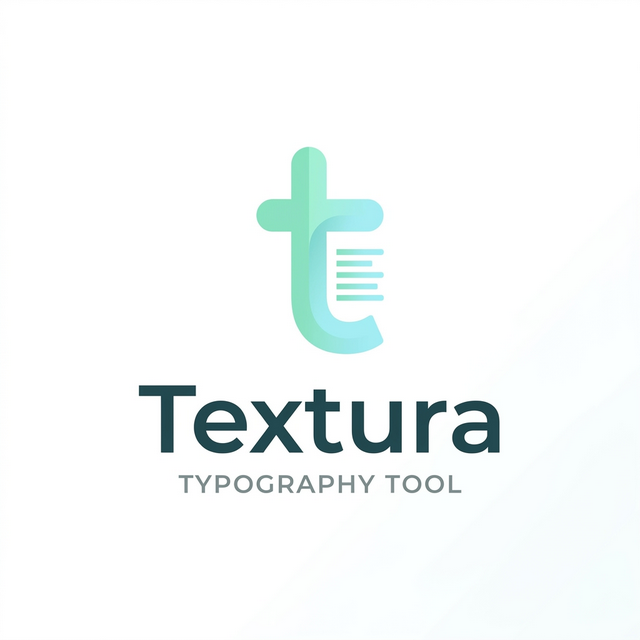

# Textura —— 重塑文字的质感 ✨

  
   
  <h3>为极致阅读体验而生的下一代排版引擎</h3>
  
基于 Next.js 15 + TailwindCSS v4 构建的现代 Markdown 微信排版工具

  

    
    
    
    
  

---

## 💡 为什么做 Textura？

在信息爆炸的时代，我们每天阅读数万字的内容。然而，大多数的阅读体验都被粗糙的、默认的排版破坏了。
**Textura** (_源自拉丁语，意为“编织、质地、纹理”_) 诞生的初衷，就是解决创作者的排版痛点：

- **告别繁琐**：通过 Markdown 语法一键生成高质量、带内联 CSS 样式的跨平台富文本。
- **专为微信生态设计**：一键复制即可无缝粘贴入微信公众号后台，格式零丢失。
- **禅模式创作**：极简的玻璃拟物化设计 (Glassmorphism)，让你专注于内容本身。

## ✨ 核心特性

- 🎨 **主题引擎驱动**
  - 内置数十种精心调配的预设主题（如：深海、薄荷、MD 经典）。
  - **自定义流体样式**：自带实时 CSS 代码编辑器，搭载安全防注入（XSS）DOMPurify 引擎，写你自己的专属设计。
  - 黄金比例行高、呼吸感字距，自动优化阅读韵律。

- 💻 **所见即所得的极客体验**
  - **三栏式弹性布局**：支持侧边栏自由拉伸与隐藏。
  - **独立设备视图**：支持模拟 iPhone、Android 或 PC 大屏预览您的最终渲染结果。
  - **可控滚动联动 (Scroll Sync)**：随心所欲在对照与解绑状态间丝滑穿梭。长文对比校对如呼吸般自然。

- 🤖 **原生接入 AI 大模型**
  - 接驳 DeepSeek、Kimi、Doubao 及自定义 API。
  - 提供润色片段、全文总结、续写等深度辅助功能。

- ⚡️ **极致的工程性能**
  - **基于 `useDeferredValue` 防抖渲染**：无论左侧挂载多宏大的文本量，高频输入始终如丝般顺滑。
  - **状态时光机**：Zustand 结合 IndexedDB 持久化与 Zundo 时间漫游，所有改动皆可追溯 (⌘+Z)。

## 🛠 技术栈

Textura 是一个追求极致前沿 (Bleeding-edge) 体验的工程：

- **框架**: [Next.js 15.1 (App Router)](https://nextjs.org/) + React 19
- **样式**: [TailwindCSS v4.0](https://tailwindcss.com/) + Shadcn/UI + Framer Motion
- **状态管理**: [Zustand](https://github.com/pmndrs/zustand) + Local Persistent + Zundo (Undo/Redo)
- **文档引擎**: `react-markdown` + `remark-gfm` + `shiki` 语法高亮
- **构建 & 容器**: 支持导出跨平台 Desktop 应用 (通过 Tauri / Electron) 准备。

## 🚀 快速开始

克隆仓库并运行本地开发服务器：

\`\`\`bash
# 1. 克隆代码
git clone https://github.com/your-username/textura.git
cd textura

# 2. 安装依赖 
npm install

# 3. 运行开发环境
npm run dev
\`\`\`

在浏览器中打开 [http://localhost:3000](http://localhost:3000) 即可看到应用。

## 🤝 贡献指南

1. Fork 本仓库
2. 创建您的特性分支 (`git checkout -b feature/AmazingFeature`)
3. 提交您的更改 (`git commit -m 'Add some AmazingFeature'`)
4. 推送到分支 (`git push origin feature/AmazingFeature`)
5. 开启一个 Pull Request

## 📄 许可协议

本项目基于 MIT 协议进行分发。详情请参阅 [LICENSE](LICENSE) 文件。
